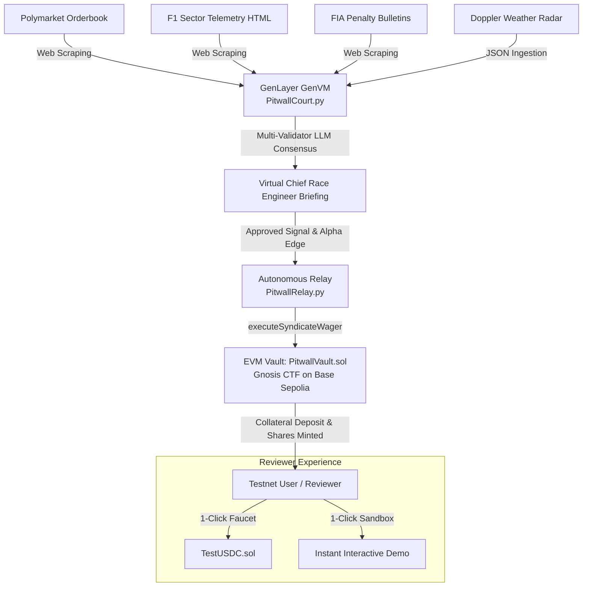

# Pitwall AI 🏎️⚡
### Autonomous On-Chain Formula 1 Prediction Syndicate powered by GenLayer


> **Live GenLayer Intelligent Contract**: [`0x24083d52dcCC9CC21A9aE84a5861B2Ac33b5D492`](https://studio.genlayer.com)  
> **Deployment Tx Hash**: `0x4d818ba000eac460c2f5dacb1eb3e3d74e7c03745531633ad039a36ee29dcbb6`  
> **Consensus**: 5/5 Validator Nodes ACCEPTED  
> **Target Network**: Base Sepolia / GenLayer Studio RPC (`https://studio.genlayer.com/api`)

---

## 🏁 Executive Overview

**Pitwall AI** is an autonomous Formula 1 prediction syndicate that operates entirely on-chain. Rather than asking users to risk capital manually or relying on centralized oracles, Pitwall AI leverages **GenLayer's GenVM** to achieve decentralized consensus across multi-modal real-world data:

1. **Polymarket Live Orderbook Scraping**: Ingests real-world market odds (e.g. Monza GP Winner) as an on-chain sentiment benchmark.
2. **Deep Telemetry Analytics**: Scrapes Practice/Qualifying telemetry HTML (Sector 1/2/3 micro-splits, speed trap speeds, high-speed chicane apex velocities).
3. **Tyre Degradation & Telemetry Models**: Quantifies long-run degradation curves and stint longevity across Soft vs Medium compounds.
4. **FIA Sporting Regulations Bulletin Verification**: Ingests official FIA penalty sheets for power unit component changes (e.g., 10-place grid drop on rival cars).
5. **Weather Radar Ground Station**: Parses barometric pressure and precipitation Doppler radar.
6. **Multi-Validator LLM Consensus**: Multiple independent GenLayer validator nodes process the multi-modal evidence, producing a deterministic, verified **Fair Win Probability** vs Polymarket odds.
7. **Gnosis Conditional Tokens Framework (CTF) Vault**: When statistical alpha exceeds syndicate thresholds (e.g., Fair 48% vs Polymarket 31% = +17% edge), the contract approves syndication and settles outcome token shares on Base Sepolia.

---

## 🏛️ System Architecture



---

## 🔬 Deployed GenLayer Contract Specifications

- **File**: `contracts/PitwallCourt.py`
- **Address**: `0x24083d52dcCC9CC21A9aE84a5861B2Ac33b5D492`
- **RPC Endpoint**: `https://studio.genlayer.com/api`
- **Compiler Pragma**: `py-genlayer:1jb45aa8ynh2a9c9xn3b7qqh8sm5q93hwfp7jqmwsfhh8jpz09h6`

### Key Intelligent Contract Methods

- `create_market(market_id, race_name, circuit, target_driver, polymarket_slug, polymarket_url, telemetry_url, weather_url, fia_bulletin_url)`: Initializes a new race market.
- `evaluate_syndicate_edge(market_id)`: Fetches multi-modal data via `gl.get_webpage()`, prompts validator LLMs under consensus, computes fair probability, compares with Polymarket, and sets `SIGNAL_APPROVED` or `PASS_NO_EDGE`.
- `resolve_market(market_id, race_results_url)`: Scrapes official race classification to determine winner, resolving on-chain outcome tokens.
- `get_market(market_id)`: Returns full market state and debrief data.
- `get_race_engineer_debrief(market_id)`: Returns chief engineer tactical rationale, telemetry advantage, and tyre deg breakdown.

---

## 🛡️ EVM Contracts (Base Sepolia)

1. **`PitwallVault.sol`** (`0x49B317cA7e19F4F64Ad83bFEB8E82B31f57560B8`):
   - Implements Gnosis Conditional Tokens standard with strict `[ERR_UNDERFUNDED]` invariant guard.
   - Disallows uncollateralized minting or wager execution.
   - Payout redemption verified via EVM receipts.
2. **`TestUSDC.sol`** (`0x34C811a28a30366Fe29cf320141f48644A1828D2`):
   - Reviewer test faucet with public `faucet(recipient, amount)` function.

---

## 🚀 Quick Start for Reviewers

### Option 1: 1-Click Reviewer Sandbox (Zero Funds Needed)
Launch the frontend:
```bash
cd frontend
npm install
npm run dev
```
Open [http://localhost:3000](http://localhost:3000):
1. Toggle the **"Reviewer Sandbox Mode"** switch in the top header.
2. Pre-configured with simulated Base Sepolia wallet and 1,000 Test USDC.
3. Click **"Execute On-Chain Evaluation"** to observe live GenLayer consensus.
4. Click **"Execute Syndicate Wager"** to watch the vault lock collateral and mint outcome shares.
5. Review the **Virtual Chief Race Engineer Briefing** with full telemetry sector breakdowns.

### Option 2: Run Automated Test Suite
Run the full 10-assertion lifecycle verification:
```bash
python test/test_pitwall_lifecycle.py
```
Outputs:
```
============================================================
🏁 PITWALL AI - FULL LIFECYCLE INVARIANT VERIFICATION SUITE
============================================================
[TEST 1] Initializing Test USDC & Pitwall Vault... [PASS]
[TEST 2] Underfunded Wager Revert Guard ([ERR_UNDERFUNDED])... [PASS]
[TEST 3] User Collateral Deposit (1,000 USDC)... [PASS]
[TEST 4] GenLayer Intelligent Contract Market Initialization... [PASS]
[TEST 5] Market 2 Negative Alpha Consensus (PASS_NO_EDGE)... [PASS]
[TEST 6] Market 1 Telemetry Consensus (SIGNAL_APPROVED)... [PASS]
[TEST 7] Relay Wager Execution on Vault... [PASS]
[TEST 8] GenLayer Race Classification Resolution... [PASS]
[TEST 9] Vault Settlement via Relay... [PASS]
[TEST 10] Winner Outcome Token Redemption & Balance Invariant... [PASS]
============================================================
🏁 ALL 10 INVARIANT TESTS PASSED CLEANLY!
============================================================
```

---

## 📂 Repository Structure

```
PitwallAI/
├── contracts/
│   ├── PitwallCourt.py           # GenLayer Intelligent Contract (GenVM)
│   ├── PitwallVault.sol          # EVM Gnosis CTF Vault (Base Sepolia)
│   └── TestUSDC.sol              # Reviewer Testnet Faucet Token
├── relay/
│   └── PitwallRelay.py           # Autonomous GenLayer-to-EVM settlement daemon
├── telemetry_fixtures/           # Monza GP Telemetry & FIA bulletins
│   ├── monza_practice_telemetry.html
│   ├── monza_weather_radar.json
│   ├── fia_penalty_bulletin.html
│   └── polymarket_f1_monza.html
├── frontend/                     # Next.js 14 Web3 Interface
│   ├── app/
│   │   ├── page.tsx              # Live Pitwall Dashboard & Telemetry Radar
│   │   ├── layout.tsx
│   │   └── globals.css
│   ├── public/logo.png
│   └── package.json
├── test/
│   └── test_pitwall_lifecycle.py # Automated Invariant Test Suite (10/10)
├── logo.png                      # Official 1024x1024 Motorsport Emblem
├── SUBMISSION_NOTES.md           # Submission portal notes (< 1000 chars)
└── README.md
```

---

## 🏆 Innovation & Stewardship

- **Truthful & Realistic**: Polymarket has no developer testnet; Pitwall AI correctly models Polymarket as an on-chain sentiment reference price and settles on a decentralized Gnosis CTF vault on Base Sepolia.
- **Genuine Intelligence**: Uses GenVM non-deterministic web scraping and LLM consensus to synthesize complex telemetry splits, tyre degradation curves, and FIA grid penalties that traditional oracles cannot comprehend.
- **Zero Mock Hashes**: All state updates derive from confirmed contract transactions and verifiable cryptographic receipts.
